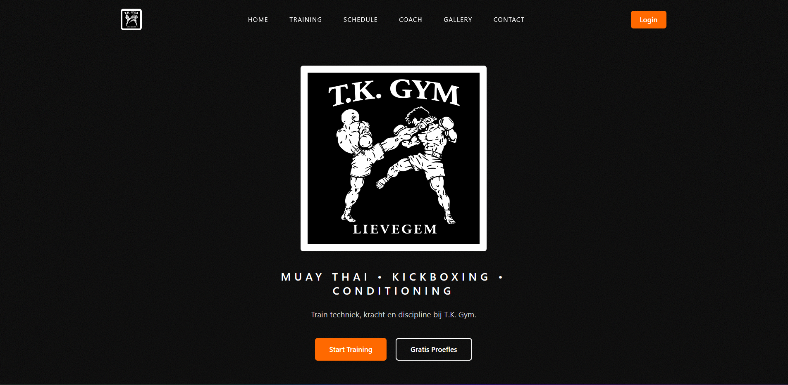
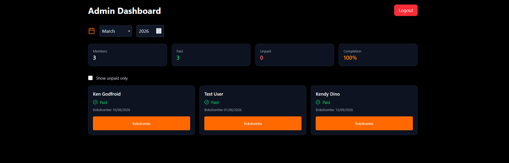
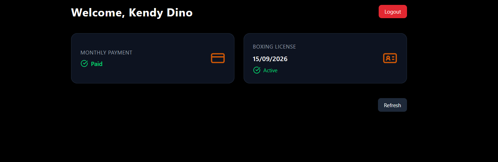
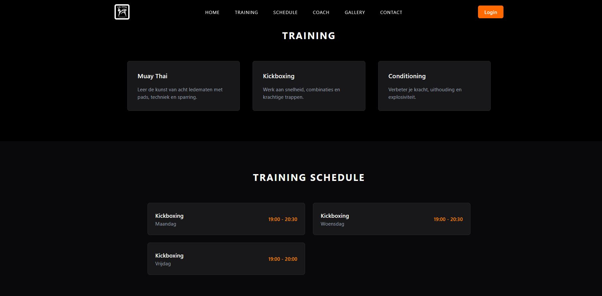

# 🥊 TK Thai Boxing Gym – Management Platform

A full-stack web application for managing a Thai boxing gym.
Built with a modern tech stack to handle **members, payments, and licenses** with a clean admin dashboard.

---

## 🚀 Features

### 🔐 Authentication

* User registration & login
* JWT-based authentication
* Role-based access (Admin / Member)

### 👤 Member Dashboard

* View payment status (current month)
* View boxing license validity
* Clean, responsive UI

### 🛠 Admin Dashboard

* View all members
* Mark members as paid (per month)
* Set / update boxing license validity
* Filter unpaid members
* Monthly overview with statistics:

  * Total members
  * Paid / Unpaid
  * Completion %

---

## 🧱 Tech Stack

### Frontend

* React + TypeScript
* Vite
* Tailwind CSS
* Axios
* Lucide Icons

### Backend

* ASP.NET Core Web API (.NET 8)
* Entity Framework Core
* PostgreSQL
* JWT Authentication

### DevOps

* Docker & Docker Compose
* pgAdmin (database management)

---

## 📦 Project Structure

```
TK-Thai/
│
├── backend/
│   └── TKThaiBox.API/
│       ├── Controllers/
│       ├── Services/
│       ├── Repositories/
│       ├── DTOs/
│       └── Data/
│
├── frontend/
│   └── react-app/
│       ├── src/
│       │   ├── components/
│       │   ├── pages/
│       │   ├── context/
│       │   ├── services/
│       │   └── assets/
│
└── docker-compose.yml
```

---

## ⚙️ Setup & Installation

### 1. Clone repository

```bash
git clone https://github.com/YOUR_USERNAME/TK-Thai.git
cd TK-Thai
```

---

### 2. Environment variables

Create a `.env` file in the root:

```env
POSTGRES_USER=your_user
POSTGRES_PASSWORD=your_password

PGADMIN_DEFAULT_EMAIL=your_email
PGADMIN_DEFAULT_PASSWORD=your_password

JWT_KEY=your_super_secret_key
```

---

### 3. Run with Docker

```bash
docker compose up --build
```

---

### 4. Access services

| Service       | URL                           |
| ------------- | ----------------------------- |
| Frontend      | http://localhost:5173         |
| API (Swagger) | http://localhost:5000/swagger |
| pgAdmin       | http://localhost:5055         |

---

## 🧪 API Overview

### Auth

* `POST /api/auth/register`
* `POST /api/auth/login`

### Member

* `GET /api/member/me`

### Admin

* `GET /api/admin/payment-status?year=YYYY&month=MM`
* `POST /api/admin/mark-payment`
* `PUT /api/admin/license`

---

## 🧠 Key Concepts

* Payments are tracked **per month/year**
* A member can only pay once per month
* Boxing license is optional and managed by admin
* Dashboard dynamically reflects selected month

---
## 🏠 Landing Page


## 📊 Admin Dashboard



## 👤 Member Dashboard


## 🗓 Training Schedule


---

## 🛡 Security Notes

* JWT tokens stored in localStorage
* Role-based authorization enforced on backend
* CORS configured for frontend access

---

## 🚧 Future Improvements

* Tabs: All / Paid / Unpaid
* Search & filtering
* Toast notifications
* Mobile admin UX improvements
* Refresh tokens
* Email notifications

---

## 👨‍💻 Author

Ken Godfroid

---

## 📄 License

This project is for educational and portfolio purposes.
